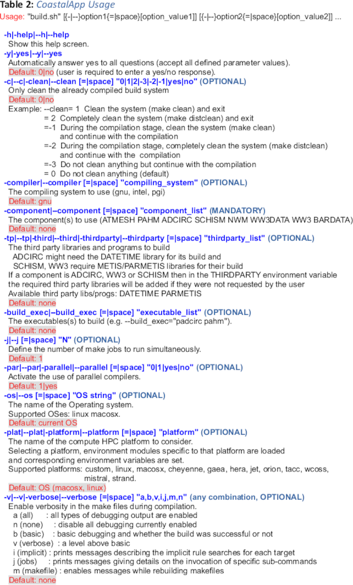

# CoastalApp

[](https://github.com/noaa-ocs-modeling/CoastalApp/actions?query=workflow%3Atests)
[](https://github.com/noaa-ocs-modeling/CoastalApp/actions?query=workflow%3Abuild)
[](https://creativecommons.org/share-your-work/public-domain/cc0)


### Contacts:
  * [Panagiotis.Velissariou@noaa.gov](mailto:Panagiotis.Velissariou@noaa.gov)
  * [Saeed.Moghimi@noaa.gov](mailto:Saeed.Moghimi@noaa.gov)


***CoastalApp*** is a modeling framework for coastal applications and regional forecasts. It consists of coupled modeling components that link the atmospheric, ocean and terrestrial realms under one common framework. CoastalApp is a flexible and portable modeling system. Flexibility means that additional modeling components can be added with ease and portability means that CoastalApp can be built and run under different computing environments and operating systems.

***CoastalApp*** is an ESMF ([https://earthsystemmodeling.org/](https://earthsystemmodeling.org/)) for building a [NUOPC](https://earthsystemmodeling.org/nuopc/)/[NEMS](https://www.nws.noaa.gov/ost/CTB/mts-arch/CFSv3-Plan-Mt-082511_files/Lapenta.pdf) coupling application that includes two types of components (a) 1-way and 2-way coupled modeling components (model source + NUOPC Cap) and (b) data components (NUOPC Cap only) that pass forcing data, as needed, via NetCDF files to the various models in CoastalApp. The application is based on its predecessor ESMF application ``ADC-WW3-NWM-NEMS`` (see [Moghimi et. al](#moghimi_1)) developed as part of the [**Coastal Act**](https://vlab.noaa.gov/web/osti-modeling/coastal-act1) coupling project to determine wind versus water percentage losses caused by a Named Storm Event.

The models and modeling components (data components) currently supported in *CoastalApp* are outlined in Table 1.


## Downloading *CoastalApp*

*CoastalApp* is hosted in NOAA's Office of Coast Survey github modeling repository: [https://github.com/noaa-ocs-modeling](https://github.com/noaa-ocs-modeling) along with other applications and models. The source code of *CoastalApp* is publicly available from the GitHub repository:
  <a href="https://github.com/noaa-ocs-modeling/CoastalApp"
     TARGET="_BLANK" REL="NOREFERRER">https://github.com/noaa-ocs-modeling/CoastalApp</a>
(binary distributions of *CoastalApp* are not currently available).

The application can be downloaded using one of the following methods:

***(1) Clone the source code from GitHub using the command:***

        git clone --recurse-submodules  https://github.com/noaa-ocs-modeling/CoastalApp.git

The source will be downloaded into the target directory CoastalApp. It is assumed that all subsequent operations are taking place
in the CoastalApp directory.

Most of the modeling components in the *CoastalApp* GitHub repository (e.g., ADCIRC, SCHISM, ...) are simply git submodules (pointers) that point to the respective repository of each model. Some models, for example ADCIRC and FVCOM, require that the user is registered with the respective model repository in order to be granted access. If the user doesn't have access to a model, he/she can exclude particular model components when cloning *CoastalApp* using, for example, commands like:

  * Exclude ADCIRC from cloning using one of the following commands:
    * ``git -c submodule."ADCIRC".update=none clone --recurse-submodules  https://github.com/noaa-ocs-modeling/CoastalApp.git``
    * ``git clone --recurse-submodules=":(exclude)ADCIRC" https://github.com/noaa-ocs-modeling/CoastalApp.git``

  * Exclude multiple components (ADCIRC, PAHM and SCHISM) from cloning using one of the following commands:
    * ``git -c submodule."ADCIRC".update=none -c submodule."PAHM".update=none -c submodule."SCHISM/schism".update=none -c submodule."SCHISM/schism-esmf".update=none clone --recurse-submodules  https://github.com/noaa-ocs-modeling/CoastalApp.git``
    * ``git  clone --recurse-submodules=':(exclude)ADCIRC' --recurse-submodules=':(exclude)PAHM' --recurse-submodules=":(exclude)SCHISM/*" https://github.com/noaa-ocs-modeling/CoastalApp.git``

***(2) Download the source archive using the command:***

        wget https://github.com/noaa-ocs-modeling/CoastalApp/archive/refs/heads/main.zip

and extract the sources in the CoastalApp directory by issuing the following commands:

        unzip -o main.zip  (the data will be extracted into the CoastalApp-main directory)

        mv CoastalApp-main CoastalApp  (move the extracted files to the CoastalApp directory)

Even though the archive is sufficient to compile *CoastalApp*, it is advisable to use the distributed version control system Git
to follow the *CoastalApp* development and updates and to easily merge to new versions.
New Git users are invited to read some of the online guides to get familiar with vanilla Git concepts and commands:

- Basic and advanced guide with the
<a href="https://git-scm.com/book/en/v2/" TARGET="_BLANK" REL="NOREFERRER">Git Book</a>.
- Reference guides with the
<a href="https://git-scm.com/docs/" TARGET="_BLANK" REL="NOREFERRER">Git Reference</a>.
- GitHub reference sheets with the
<a href="https://training.github.com/" TARGET="_BLANK" REL="NOREFERRER">GitHub Reference</a>.
- Manage your GitHub repositories with Git
<a href="https://docs.github.com/en/get-started/using-git/" TARGET="_BLANK" REL="NOREFERRER">Using Git</a>.


## Building *CoastalApp*

The build infrastracture in CoastalApp uses a hybrid "Make" system based on [GNU Make](https://www.gnu.org/software/make/) and [CMake](https://cmake.org/) toolkits that manage building of the source code and the generation of executables and other non-source files of a program. Furthermore, *CostalApp* utilizes environment module systems
like [Lmod](https://lmod.readthedocs.io/en/latest/) (installed in most HPC clusters) or 
[Environment Modules](https://modules.readthedocs.io/en/latest/).

### Requirements

 1. Recent version of CMake (**version &ge; 3.2**).
 2. Recent Fortran/C/C++ compilers: The compilers tested are **Intel &ge; 18**, **GCC &ge; 4.8** and **PGI/NVidia &ge; 20.11**.
 3. Recent MPI implementation: The Message Passing Interface libraries tested are [Intel's MPI](https://www.intel.com/content/www/us/en/developer/tools/oneapi/mpi-library.html#gs.owl7s3), [OpenMPI](https://www.open-mpi.org/) and [MVAPICH](https://mvapich.cse.ohio-state.edu/).
 4. Recent version of the <a href="https://www.unidata.ucar.edu/software/netcdf/" TARGET="_BLANK" REL="NOREFERRER">NetCDF-4</a> libraries: the Network Common Data Form (NetCDF) C and Fortran libraries (usually installed in the host OS).
 5. Recent version of the <a href="https://www.hdfgroup.org/" TARGET="_BLANK" REL="NOREFERRER">HDF5</a> libraries: the High-performance software and Data Format (HDF) libraries (usually installed in the host OS).
 6. Recent version of the <a href="https://earthsystemmodeling.org/" TARGET="_BLANK" REL="NOREFERRER">ESMF</a> libraries: the Earth System Modeling Framework (**version &ge; 8.1**).
 7. <a href="https://github.com/KarypisLab/ParMETIS" TARGET="_BLANK" REL="NOREFERRER">ParMETIS</a> libraries (Optional). This library is required if building WaveWatch III (WW3 component, mandatory) or SCHISM (optional). The library is not shipped with *CoastalApp* and it is the user's responsibility to download the library before compiling *CoastalApp*. The script ``download_parmetis.sh`` in CostalApp/scripts directory is supplied for this reason.

**NOTE:** It is important to note that the user needs to make sure that all the libraries and *CoastalApp* are compiled using exactly the **same compilers** (and possibly versions; you cannot mix compilers and
compiler versions).


### Build System

To build *CoastalApp* the user should run the ***build.sh*** bash script (a link to the
scripts/build.sh) located in the root directory of the downloaded source code.
The build script accepts many options to allow the user to customize the compilation of *CoastalApp*. Running the script as:

        build.sh --help

will bring up a help screen as shown in Table 2 that explains the use of all available options to the script:




### Installing ParMETIS (Optional)

The unstructured WW3 and SCHISM models require the use of ParMETIS/METIS libraries for domain decomposition. While, the installation of this library is mandatory for WW3
(at this point), for SCHISM is optional as the model contains an internal version of ParMETIS (the model can use either the internal or the externally built library or do not use ParMETIS at all). To ease the compilation of the library, *CoastalApp* supplies the script ``scripts/download_parmetis.sh`` to first download the source code of the library and then build the library by supplying the option ``--tp parmetis`` to the build script.
The library source is downloaded into the CoastalApp/thirdparty_open directory.
Assuming that ParMETIS is already downloaded, to build ParMETIS and WW3 run the build
script as follows:

        build.sh -compiler intel -platform=hera --component ww3 --tp=parmetis

The above command will first compile ParMETIS and then will continue with the compilation of WW3 (notice the different format used for the supplied options, all work the same way). ParMETIS libraries will be installed in the CoastalApp/THIRDPARTY_INSTALL direcory (this directory never gets deleted during a clean process).

If the user wants to compile SCHISM using the already compiled ParMETIS, then he/she
can run the build script as:

        PARMETISHOME=FULL_PATH_TO/CostalApp/THIRDPARTY_INSTALL build.sh -compiler intel -platform=hera --component schism

and *CoastalApp* will use the install ParMETIS in CostalApp/THIRDPARTY_INSTALL. If there is a sytem wide install ParMETIS, the user can set the PARMETISHOME variable to
point to the system's installed ParMETIS.

### Compilation

This section contains some generic instructions of how to build *CoastalApp* (NEMS
application). The contents of this section will change soon.

```bash
./build.sh --help
```

The following example builds `NEMS.x` with ADCIRC, ATMESH, and WW3DATA,
using variables / modules from the Hera environment, compiling with the
Intel compiler, and cleaning before building.

```bash
./build.sh --component "ADCIRC ATMESH WW3DATA" --plat hera --compiler intel --clean -2 
```

Change directory to CoastalApp-testsuite/CoastalApp:

``cd CoastalApp``

and run the build.sh script to fit your organization's configuration:

`` ./build.sh --compiler intel --platform hera --component "atmesh pahm adcirc ww3"  -y``

In the case of ww3, the ParMETIS library is required to build ww3. To use ParMETIS within CoastalApp, you need to first download ParMETIS by running the script: ``scripts/download_parametis.sh``

This command will install the ParMETIS codes into CoastalApp/thirdparty_open.

In this case you need to run the build.sh script as:

`` ./build.sh --compiler intel --platform hera --component "atmesh pahm adcirc ww3" --tp parmetis  -y``

If you want to use a pre-build ParMETIS library in your system, you may run the build script as:

``PARMETISHOME=YOUR_INSTALLED_PARMETIS_LOCATION ./build.sh --compiler intel --platform hera --component "atmesh pahm adcirc ww3"  -y``

To get the full list of options that the build script accepts with brief explanations, you may run the script as: ``./build.sh --help``

### Components

- `--component` can be any combination of
    - `ADCIRC`
    - `ATMESH`
    - `WW3` / `WW3DATA`
    - `NWM`

```bash
./build.sh --component "ADCIRC WW3" --plat hera --compiler intel --clean -2 
```

```bash
./build.sh --component "SCHISM" --plat orion --compiler intel --clean -2
```

### Platforms

- `--plat` can be one of
    - `hera`
    - `stampede`
    - `wcoss`
    - `orion`
    - `jet`
    - `gaea`
    - `cheyenne`
    - `linux`
    - `macosx`
    - `macports`

For MacOS running MacPorts, use the `macports` option.

```bash
./build.sh --component "SCHISM" --plat hera --compiler intel --clean -2
```

```bash
./build.sh --component "SCHISM" --plat orion --compiler intel --clean -2
```

### Compiler

- `--compiler` can be one of
    - `intel`
    - `gnu`
    - `pgi`

```bash
./build.sh --component "SCHISM" --compiler gnu --plat macports
```

```bash
./build.sh --component "SCHISM" --compiler intel --plat hera
```

### Clean

- `--clean` is optional, and can be one of
    - ` ` (`make clean` and exit)
    - `1` (`make clean` and exit)
    - `2` (`make clobber` and exit)
    - `-1` (`make clean` and build)
    - `-2` (`make clobber` and build)

```bash
./build.sh --component "SCHISM" --compiler intel --plat hera --clean
```

```bash
./build.sh --component "SCHISM" --compiler intel --plat hera --clean -1
```
## Organization / Responsibility

#### `NEMS` application implementing ESMF / NUOPC coupling
- Saeed Moghimi (**lead**) - saeed.moghimi@noaa.gov
- Panagiotis Velissariou - panagiotis.velissariou@noaa.gov

Former Contributors:

- Zachary Burnett - zachary.burnett@noaa.gov
- Andre Van der Westhuysen - andre.vanderwesthuysen@noaa.gov 
- Beheen Trimble - beheenmt@gmail.com

#### ESMF / NUOPC cap for `ADCIRC` model
- Saeed Moghimi (**lead**) saeed.moghimi@noaa.gov
- Guoming Ling - gling@nd.edu
- Damrongsak Wirasaet - dwirasae@nd.edu
- Panagiotis Velissariou - panagiotis.velissariou@noaa.gov
- Zachary Burnett - zachary.burnett@noaa.gov
#### ESMF / NUOPC cap for `FVCOM` model
- Jianhua Qi (**lead**) - jqi@umassd.edu
- Saeed Moghimi - saeed.moghimi@noaa.gov
#### ESMF / NUOPC cap for `SCHISM` model
- Carsten Lemmen (**lead**) - carsten.lemmen@hzg.de  
- Y. Joseph Zhang - yjzhang@vims.edu
#### ESMF / NUOPC cap for `WW3` model
- Andre Van der Westhuysen (**lead**) - andre.vanderwesthuysen@noaa.gov
- Ali Abdolali - ali.abdolali@noaa.gov
#### `PaHM` model and ESMF / NUOPC cap for `PaHM` model
- Panagiotis Velissariou (**lead**) - panagiotis.velissariou@noaa.gov
#### `ATMESH` data component and ESMF / NUOPC cap for `ATMESH` data component
- Saeed Moghimi (**lead**) saeed.moghimi@noaa.gov
- Guoming Ling - gling@nd.edu
- Panagiotis Velissariou - panagiotis.velissariou@noaa.gov
#### ESMF / NUOPC cap for `NWM` model
- Daniel Rosen (**lead**) - Daniel.Rosen@noaa.gov
- Beheen Trimble - beheenmt@gmail.com
- Jason Ducker - jason.ducker@noaa.gov
- other colleagues from NWS / OWP

## Contributing

Feel free to fork this repository and create a pull request with
contributions.

#### adding a new platform / compiler to compilation script

Environment files are stored in `modulefiles/` with the
filename `envmodules_<COMPILER>.<PLATFORM>`

To compile in your own system you should create a similar file, then
run `build.sh` to compile.

## Collaboration

To collaborate and contribute to this repository follow below instructions:

1. go to https://github.com/noaa-ocs-modeling/CoastalApp
2. create a fork (click `Fork` on the upper right corner), and fork to your account.
3. clone your forked repository
   ```bash
   git clone --recursive https://github.com/<ACCOUNT>/CoastalApp
   ```
4. edit the files locally
   ```bash
   git status
   ```
5. commit changes
   ```bash
   git commit -a -m "describe what you changed"
   ```
6. push your changes to GitHub
   ```bash
   git push
   ```
7. enter your GitHub username/password if asked
8. create a pull request with descriptions of changes at
   ```
   https://github.com/noaa-ocs-modeling/CoastalApp/compare/<BRANCH>...<ACCOUNT>:<BRANCH>
   ```

## Citations

<a name="moghimi_1"></a>
[1] Moghimi, S., Van der Westhuysen, A., Abdolali, A., Myers, E., Vinogradov, S., 
   Ma, Z., Liu, F., Mehra, A., & Kurkowski, N. (2020). Development of an ESMF 
   Based Flexible Coupling Application of ADCIRC and WAVEWATCH III for High 
   Fidelity Coastal Inundation Studies. Journal of Marine Science and 
   Engineering, 8(5), 308. https://doi.org/10.3390/jmse8050308

<a name="moghimi_2"></a>
[2] Moghimi, S., Vinogradov, S., Myers, E. P., Funakoshi, Y., Van der Westhuysen, 
   A. J., Abdolali, A., Ma, Z., & Liu, F. (2019). Development of a Flexible 
   Coupling Interface for ADCIRC model for Coastal Inundation Studies. NOAA 
   Technical Memorandum, NOS CS(41). 
   https://repository.library.noaa.gov/view/noaa/20609/

<a name="moghimi_3"></a>
[3] Moghimi, S., Westhuysen, A., Abdolali, A., Myers, E., Vinogradov, S., Ma, Z., 
   Liu, F., Mehra, A., & Kurkowski, N. (2020). Development of a Flexible 
   Coupling Framework for Coastal Inundation Studies. 
   https://arxiv.org/abs/2003.12652

